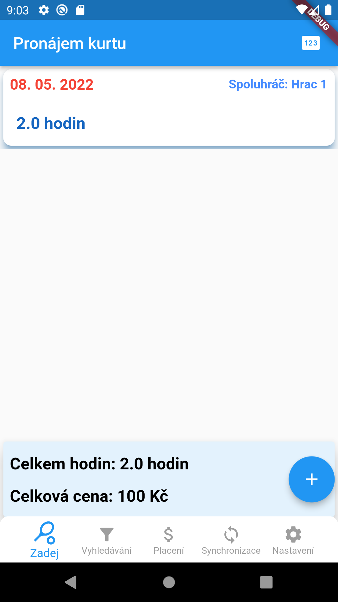
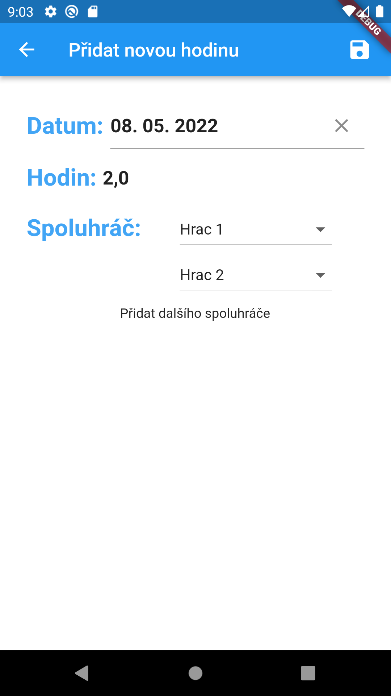
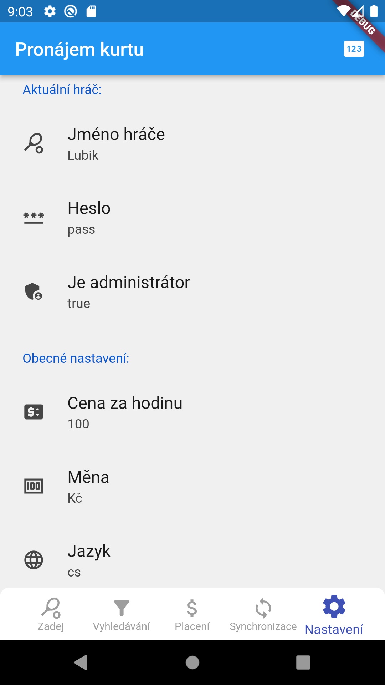
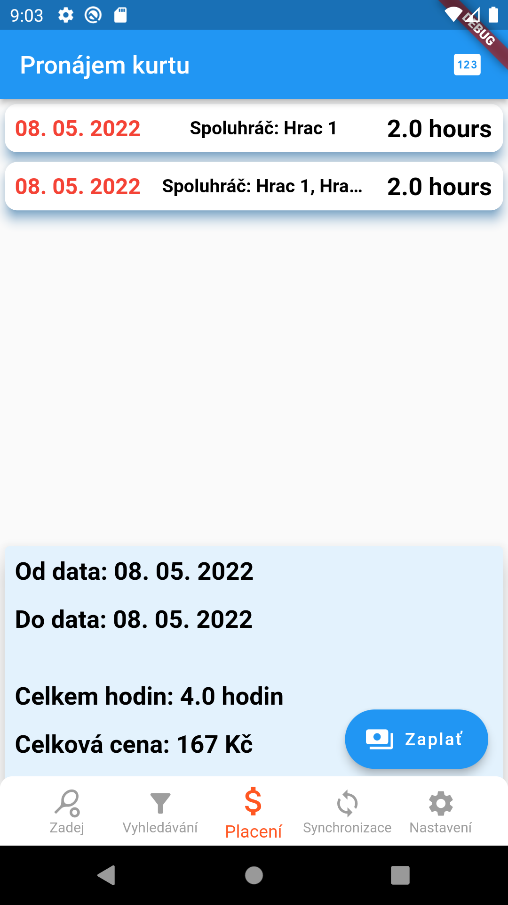

# Tennis Cash Court

Keeps track of court-rental hours and who still owes for them. Flutter application, 2022.

## The problem

You book a tennis court by the hour and play with whoever is available. The court is paid for by
the hour, not per player, so the cost of each session has to be divided between the people who
actually turned up — and then someone has to remember who has already settled up.

## What it does

- **Record a session** — date, number of hours, and the partners who played
- **Cost split** derived from the hourly rate in settings and the number of players in that
  session; the rate and the currency are both configurable
- **Outstanding balance per player**, with a payment screen for marking a debt as settled
- **Filtering** by period and by player, with summary cards over the selected range
- **Players sign in** with a name and a password, checked against the player list held on the
  device; one player can be flagged as administrator
- **Sync** — the hours and the player list are pushed to and pulled from Firebase Realtime
  Database, so the record is available on more than one phone
- English and Czech, through GetX `Translations`

## Screenshots

| Main screen | Add player |
|---|---|
|  |  |

| Settings | Payment |
|---|---|
|  |  |

## Implementation notes

```
lib/
  controllers/   GetX controllers, including the authentication flow
  model/         player, tennis_hour, database and storage models
  view/          screens, cards, dialogs, custom navigation bar
  others/        constants, languages, file logging
```

Built on **GetX** for state, routing and dependency lookup — `Get.find()` is used from inside the
model classes themselves. This is the one project here that uses GetX; everything I wrote after it
uses BLoC instead, with the model layer kept free of any service locator.

Records are serialised with `json_serializable`, held locally in `get_storage`, and mirrored into
Firebase Realtime Database under two branches: `hours` and `players`.

Note that sign-in is **not** Firebase Authentication — `MyAuthenticationService` validates the
name and password against the locally stored player list. `firebase_auth` is listed in
`pubspec.yaml` but never used.

## Trying it out

The application needs a Firebase project of its own. Mine is not in the repository — the
configuration files are git-ignored — so you have to point it at yours. It takes about five
minutes.

**1. Create the Firebase project**

In the [Firebase console](https://console.firebase.google.com/), create a project and add an
Android app (and an iOS app, if you want to build for iOS). The identifiers this project uses are
`com.example.tennis_cash_court` on Android (`android/app/build.gradle`) and
`com.example.tennisCash` on iOS (`PRODUCT_BUNDLE_IDENTIFIER` in the Xcode project) — register
those, or change them to your own first.

**2. Enable the Realtime Database**

Build → Realtime Database → Create database. **Realtime Database, not Cloud Firestore** — the app
uses `firebase_database`. Start it in locked mode; you will set the rules in step 4.

**3. Generate the configuration**

```bash
dart pub global activate flutterfire_cli
flutterfire configure
```

This writes `lib/firebase_options.dart` and drops `google-services.json` /
`GoogleService-Info.plist` into the platform directories. All three are git-ignored on purpose.
If you would rather fill the values in by hand, copy `lib/firebase_options.example.dart` to
`lib/firebase_options.dart` and replace the placeholders.

**4. Set the database rules**

The app has no server-side identity — it signs players in locally — so the database cannot
distinguish one user from another. For anything beyond a private trial, keep it closed and only
open it while you are testing:

```json
{
  "rules": {
    ".read": false,
    ".write": false
  }
}
```

Opening it with `".read": true, ".write": true` will work for a quick look, but it makes the data
world-readable and world-writable. Do not leave it that way.

**5. Run it**

```bash
flutter pub get
dart run build_runner build --delete-conflicting-outputs
flutter run
```

On first launch, create the players in settings — that list is what the login screen checks
against — then set the hourly rate and the currency.

## Status

Archived. `TODO.txt` still holds the one thing that was never finished — automatic sync to
Firebase rather than sync on demand.
